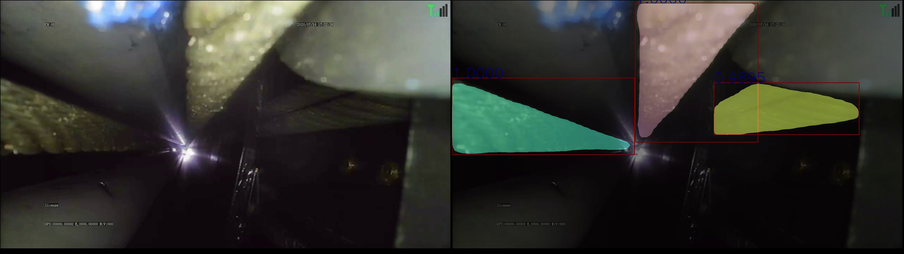

# detectron2_instance_segmentation
在detectron2的基础上, 训练mask-rcnn模型，完成工业视觉任务

## 任务描述

分割管道中的绳子

## 流程
1. 安装 [labelme](http://labelme2.csail.mit.edu/Release3.0/index.php?message=1)
2. 安装 [Detectron2](https://github.com/facebookresearch/detectron2/blob/master/INSTALL.md)
3. 运行 `labelme` 选择polygons 进行分割标, 得到[annotation.json](./Lark20210319-111739.json)
4. 注册 `detectron2` 可用的数据集具体参见 `dataset.py`
5. 训练 mask-rcnn, 参见 `train.py` 需要修改的 
- `cfg.merge_from_file` 模型选择
- `cfg.DATASETS.TRAIN` 训练数据集为步骤 `4` 中注册的数据集
- `cfg.MODEL.WEIGHTS` 预训练模型位置
- `cfg.MODEL.ROI_HEADS.NUM_CLASSES` 类别总数
6. infer 过程 `infer.py`
## 结果

